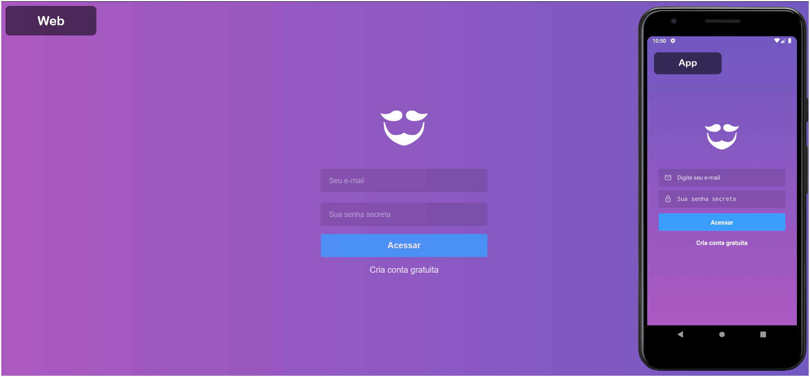
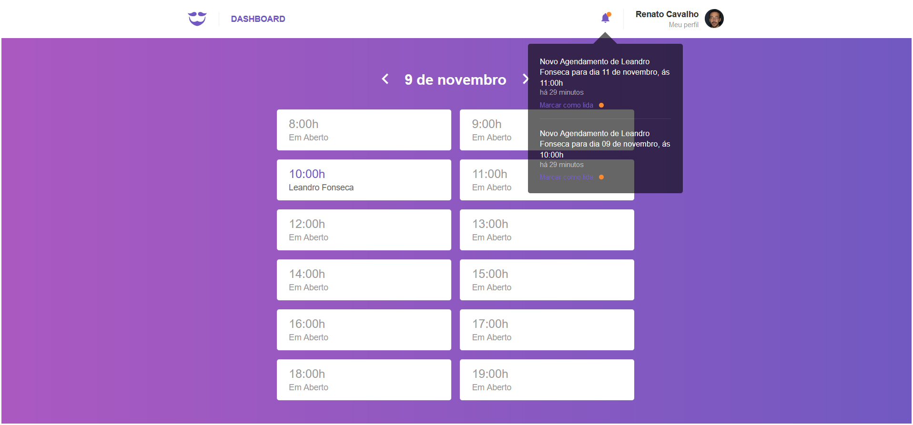
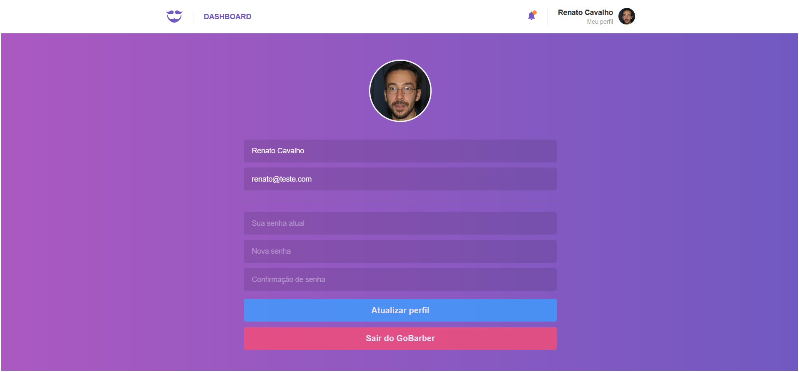
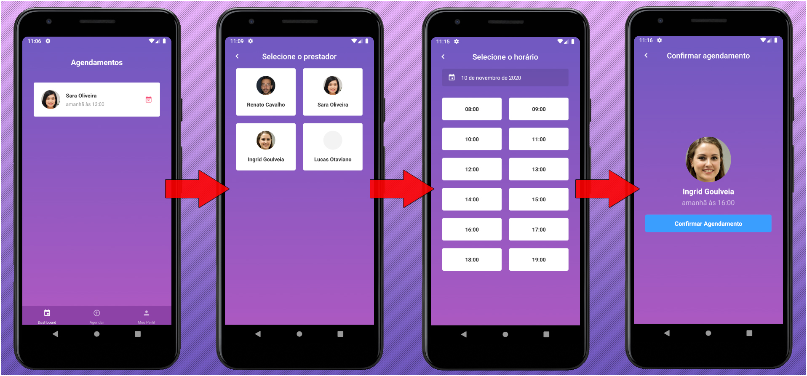

<p align="center">
  
</p>

# GoBaber
  
 
<p align="center">
  
</p>

## Sobre o Projeto
<p>O Gobaber é uma plataforma de agendamentos de serviços que tem como objetivo conectar um prestador de serviço a um cliente.</p>

### Web
<p align="center">
  
</p>
 <p>A parte web da aplicação só pode ser acessada por prestadores de serviços cadastrado na plataforma. Após o login o prestador pode acompanhar os agendamentos dos clientes e gerencia o seu perfil.</p>
 <p align="center">
  
</p>

### Mobile
<p align="center">
  
</p>
<p>A parte mobile da aplicação só pode ser acessada por clientes. Após o login o cliente pode escolher entre um dos prestadores, e agendar uma data e hora que nenhum outro cliente escolheu, além de gerenciar o seu perfil.</p>

## Tecnologias

- [x] NodeJS
- [x] Express
- [x] Sequelize
- [x] React
- [x] Axios
- [x] Styled Components
- [x] React Router Dom
- [x] React Native
- [x] React Navigator

## Instalação
### Back-end 
```
cd gobaber-backend
npm install
configurar o arquivo .env conforme o exemplo
npx sequelize-cli db:migrate
npm run dev
```

### Fron-end (Web)
```
cd gobaber-web
npm install
npm run start
```

### Fron-end (Mobile) `Requer o Android Studio + Emulador Android`
```
Abra o Emulador no Android Studio
cd gobaberMobile
npx react-native run-android
```
